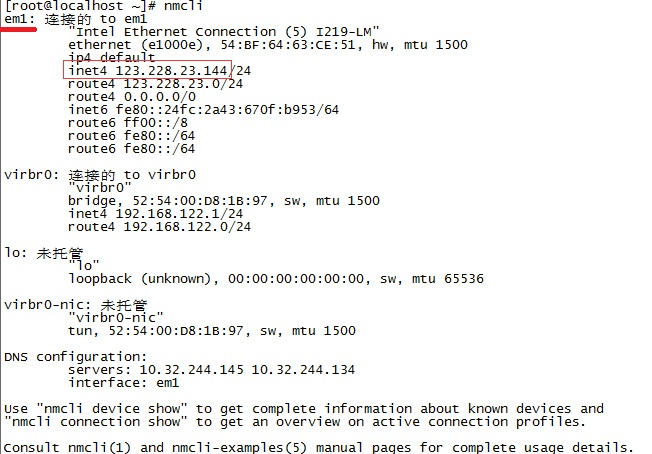
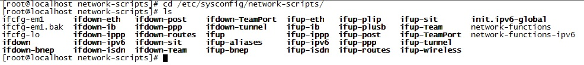
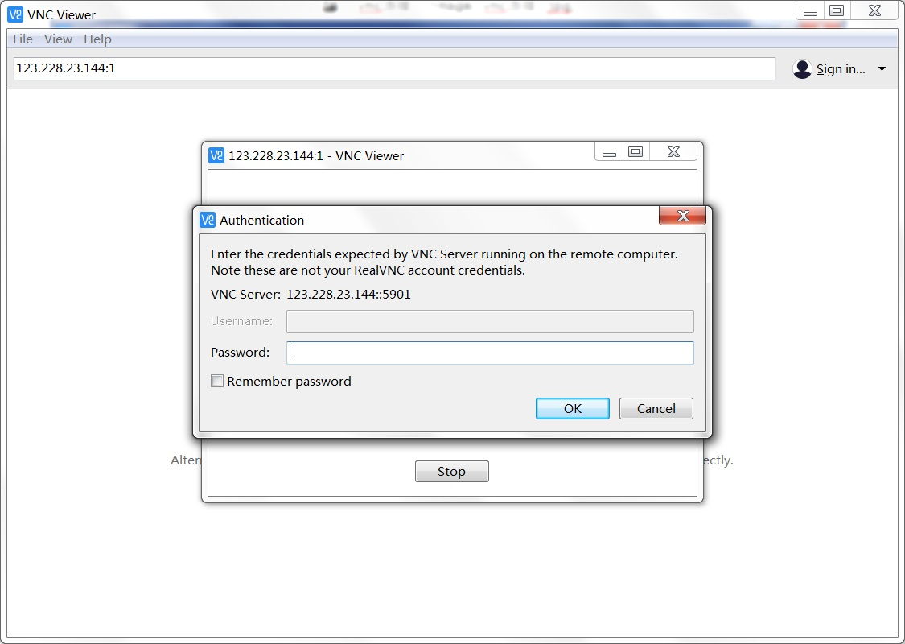

# Linux CentOS 7 配置
---
## 简单初始设置
---

### 配置固定IP地址

若使用图形界面，配置方式与Windows相似，以下说明如何使用终端命令行进行配置。

使用nmcli命令查看当前连接的网路的网卡设备和ip，使用当前可用的IP地址作为固定IP。

如下设备是em1，ip是123.228.23.144



根据查到的设备名，修改其配置文件：

```
cd /etc/sysconfig/network-scripts/
vi ifcfg-em1
```




### 配置主机名
设置主机用以便简单标识当前服务器的作用。

```
vi /etc/hostname
```

## 环境安装

### 安装JDK

首先获取想要安装的jdk的下载地址：

#### 

下载jdk，地址替换为上面获取到的地址。

```
wget --header "Cookie: oraclelicense=accept-securebackup-cookie" http://download.oracle.com/otn-pub/java/jdk/8u181-b13/96a7b8442fe848ef90c96a2fad6ed6d1/jdk-8u181-linux-x64.rpm?AuthParam=1536111689_b0a0712c5034d511302f6a0111d70f2b
```

下载完成后安装

```
yum localinstall jdk-8u181-linux-x64.rpm
```

配置环境变量 

```
vi /etc/profile 
```

在最后添加：

```
export JAVA_HOME=/usr/java/default/
export JRE_HOME=/usr/java/default/jre
PATH=$PATH:$HOME/bin:$JAVA_HOME/bin
```

使配置文件立刻生效

```
source /etc/profile
```

确认版本正确安装

```
echo $JAVA_HOME
java -version
```

---
## 安装VNC server （可选）

VNC是用于远程控制的工具软件，即可以远程到服务器的图形界面，所以需要linux系统安装有图形界面才会起到作用。

服务器端需要安装配置VNC server。

```
yum install tigervnc-server -y    	#CentOS/RHEL 6开始版本的安装

yum install vnc-server -y			#如果是CentOS/RHEL 5，则执行此命令
```

安装成功后设置vnc的连接密码

```
vncpasswd
```

随后需要创建VNC的配置文件，复制已有的模板来修改。

```
cp /lib/systemd/system/vncserver@.service /lib/systemd/system/vncserver@:1.service
cp /lib/systemd/system/vncserver@.service /lib/systemd/system/vncserver@:2.service
```

这里的vncserver@:1.service为root用户的登录配置文件，vncserver@:2.service为普通用户的配置文件

使用vi编辑复制出来的文件：

```
vi /lib/systemd/system/vncserver@:1.service
```

主要修改<USER>和用户文件夹的路径：

```
[Unit]
Description=Remote desktop service (VNC)
After=syslog.target network.target

[Service]
Type=forking
# Clean any existing files in /tmp/.X11-unix environment
ExecStartPre=/bin/sh -c '/usr/bin/vncserver -kill %i > /dev/null 2>&1 || :'

ExecStart=/usr/sbin/runuser -l <USER> -c "/usr/bin/vncserver %i"
#上面一行修改为：ExecStart=/usr/sbin/runuser -l root -c "/usr/bin/vncserver %i"
PIDFile=/home/<USER>/.vnc/%H%i.pid
#上面一行修改为：PIDFile=/root/.vnc/%H%i.pid

ExecStop=/bin/sh -c '/usr/bin/vncserver -kill %i > /dev/null 2>&1 || :'

[Install]
WantedBy=multi-user.target
```

（关于vi的使用：按 i 进入编辑模式，修改好后按Esc退出编辑模式，输入：wq回车保存修改）

vncserver@:2.service修改同理，也可不配置。

修改完成后reload使文件生效：

```
systemctl daemon-reload
```

最后启动服务：

```
systemctl start vncserver@:1.service
```

设置开机启动：

```
systemctl enable vncserver@:1.service
```

#### 配置防火墙：

防火墙可能会拦截掉远程连接，可以选择直接关闭防火墙，或者开放我们需要的连接端口，推荐后者。

Centos 7 防火墙配置和Centos 6的有很大不同，本文档只针对Centos 7 的配置。

查看防火墙的状态：

```
firewall-cmd --state 
```

1.关闭防火墙（不推荐）

```
#临时关闭
systemctl stop firewalld
#禁止开机启动
systemctl disable firewalld
```

2.开放VNC可能用到的端口：

```
firewall-cmd --zone=public --add-service=vnc-server --permanent  
#永久的把vnc-server服务加进防火墙

firewall-cmd --zone=public --add-port=5901-5905/tcp --permanent    
#永久的把该端口添加进防火墙

firewall-cmd --reload    #重启防火墙，让刚才的设置生效
```

#### Windows 连接到服务器

在Windows下，安装VNC Viewer，输入正确IP地址：



密码为之前设置的vncpasswd。