# Linux CentOS 7 安装
---

## 方式-U盘安装

### 准备U盘和Centos7镜像

* U盘（大于1G，大于4G可以制作标准版安装盘）
* UltraISO 软件  --用于制作启动预判U盘
* Centos7镜像文件

荐使用阿里镜像下载：
   <a href="https://mirrors.aliyun.com/centos/7/isos/x86_64/" target="_blank">https://mirrors.aliyun.com/centos/7/isos/x86_64/</a>


    CentOS-7-x86_64-DVD-1804.iso 		标准版
    CentOS-7-x86_64-Minimal-1804.iso	最小版

###  制作安装U盘

1.安装好UltraISO后，点开文件-打开：选择下载好的CentOS镜像文件(.iso)


2.选择启动-写入硬盘映像，如图选择u盘和写入方式后，直接进行“写入”。

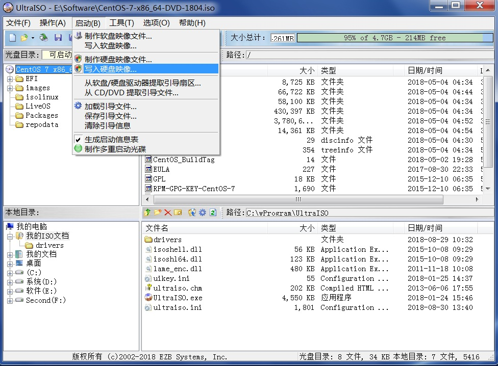

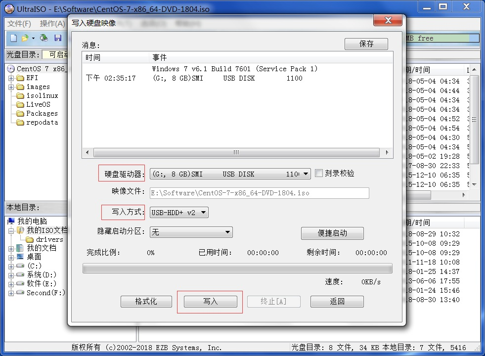

等待执行完成后，Centos的安装U盘即制作完成。

### 进行U盘安装

1.插好制作好的安装U盘后，重启电脑，进入BIOS修改第一启动项为U盘启动。

例如本人是DEll电脑，开机出现DEll的logo图标时点击F2可以进入BIOS配置启动项，或直接点击F12，选择想要的启动项，选中安装U盘后，进入Centos7的安装界面。

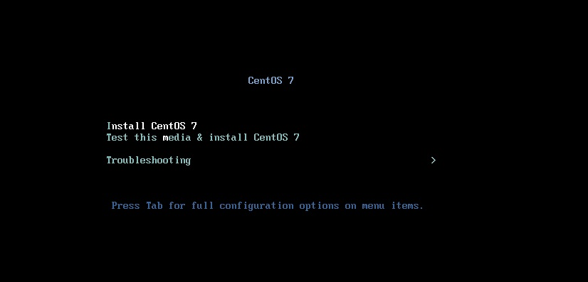

光标移动到“Install CentOS 7”，按下E，编辑安装命令：

```java
vmlinuz initrd=initrd.img inst.stage2=hd:LABEL=CentOS\x207\x20x86_64 quiet
```

改成

```
vmlinuz initrd=initrd.img linux dd quiet 
```

用于查看当前U盘的挂载点名字。修改完成后使用Ctrl+x执行，记住U盘挂载点名字，如sda4，sdc4等，可以通过Centos7的标志识别。

记住后输入c，回车，再使用Ctrl+Alt+Delete重新启动电脑，再次进入CentOS 7的安装界面。

再次按下E，编辑安装命令：
```java
vmlinuz initrd=initrd.img inst.stage2=hd:LABEL=CentOS\x207\x20x86_64 quiet
```

改成如下（注意“sda4”要改为刚才查看到的名字）

```
vmlinuz initrd=initrd.img inst.stage2=hd:/dev/sda4 quiet 
```

修改完成后使用Ctrl+x执行，随后进入图形界面进行安装：

1.选择安装时的语言：

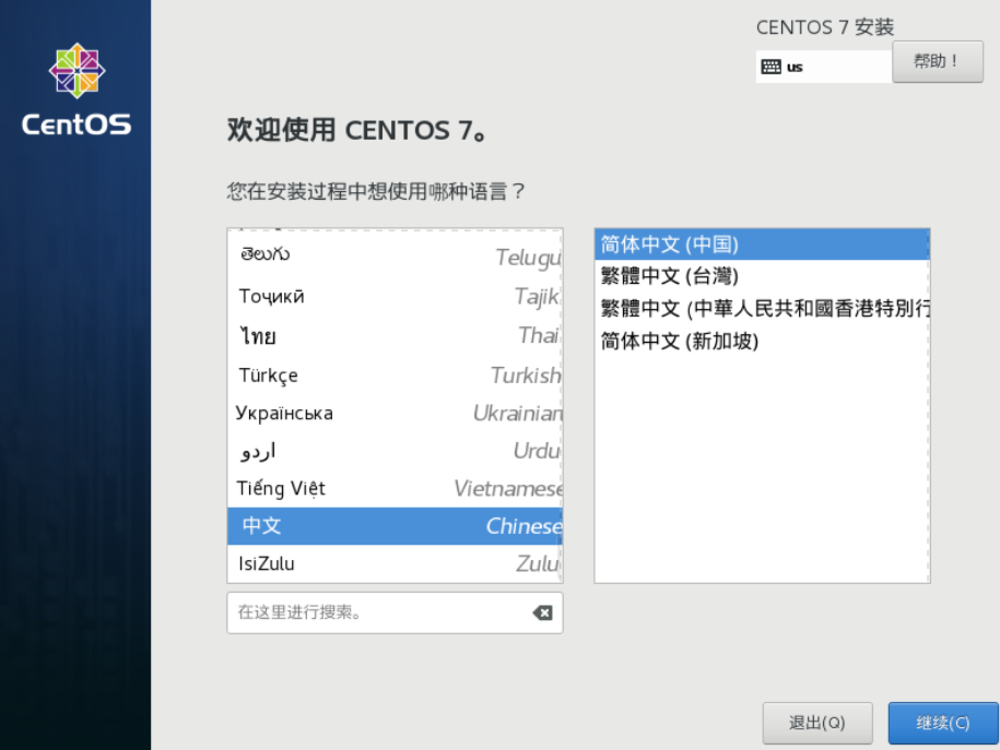


2.进入安装主界面，主要配置下面三项，安装位置为必须选择配置，其他两项可选。

（个人推荐选择安装图形界面，可以更为简单的解决一些问题，如需要，随后可以配置启动等级关闭图形界面，副作用只有占用一些硬盘空间而已。）

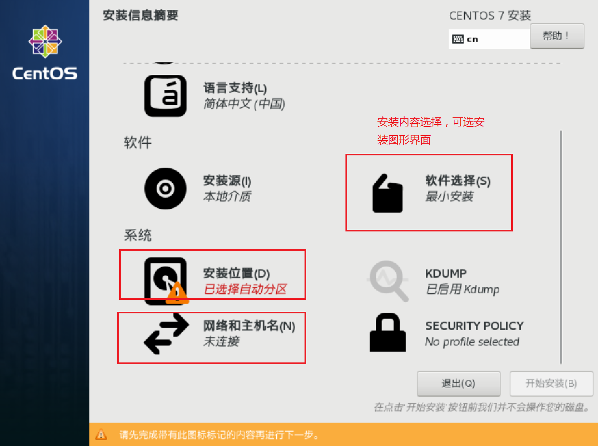

#### 选择安装位置项的配置

如服务器有多个硬盘，记得全部勾选上。（注意不要勾上插入的安装U盘）

选择我要配置分区后，点击左上角的完成。

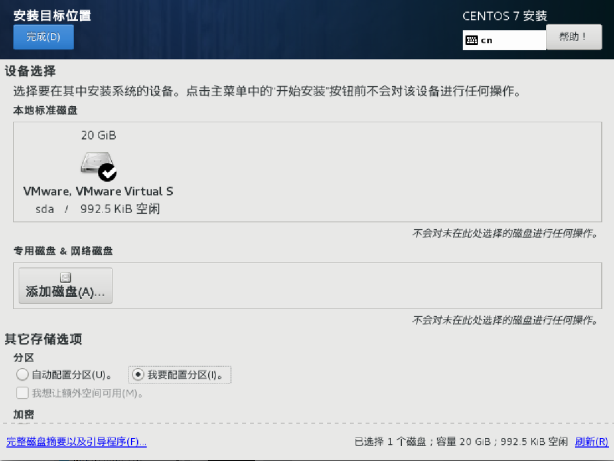

如果机器本身安装有其他操作系统，如Windows，使用下方的“—”号来删去其他系统的分区。随后选择“点这里自动创建他们（C）”进行自动分区，点击左上角的完成。

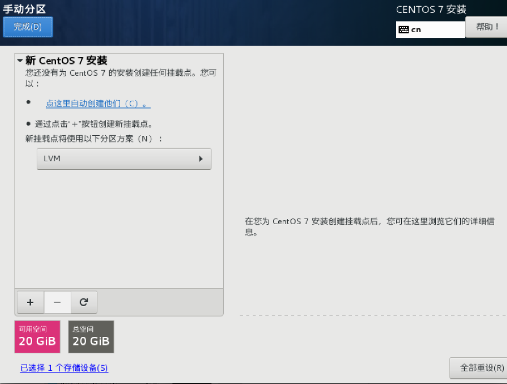

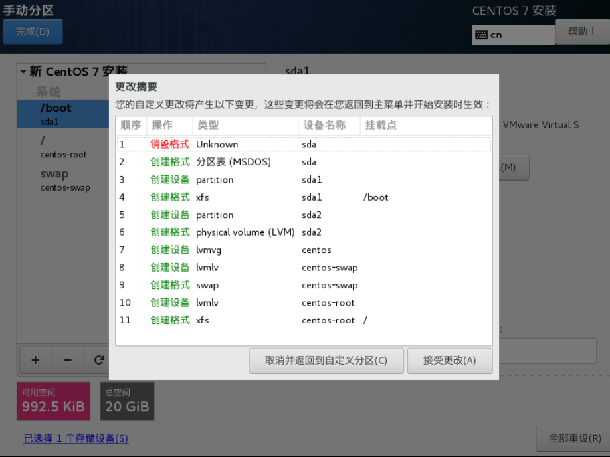

#### 安装主界面选择“网络和主机名”

打开网络即可。

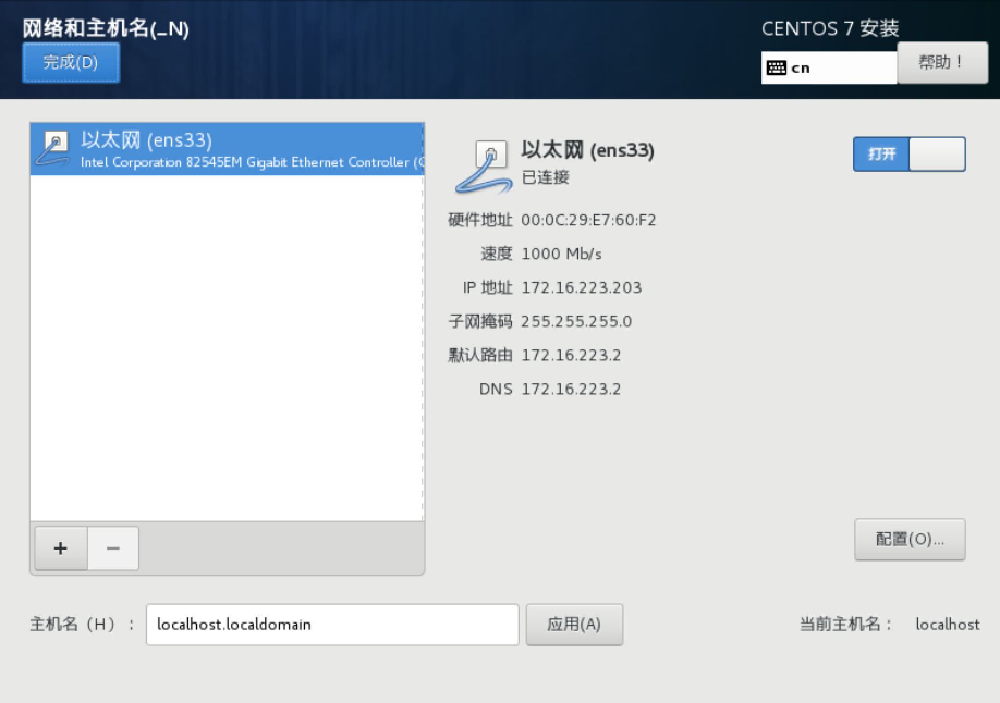

#### 安装主界面选择“软件选择”

如下图可选择安装图形界面。（可选）

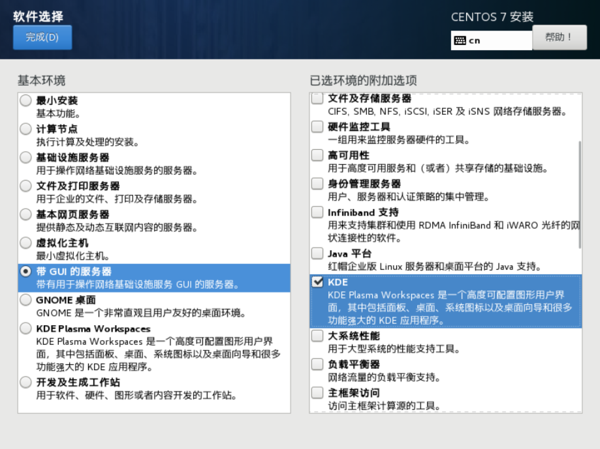

#### 开始安装

完成配置后点击“开始安装”进入如下页面，点击“Root密码”，设置root用户的密码。

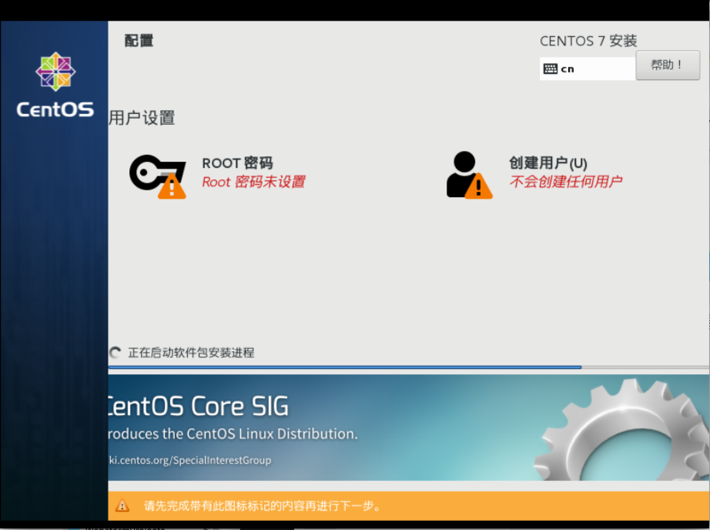

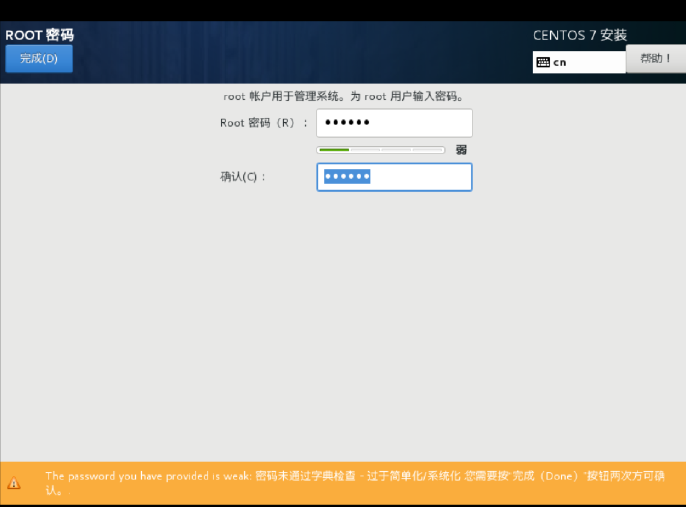

随后等待安装完成后，点击重新启动即可自动进入Centos的系统。

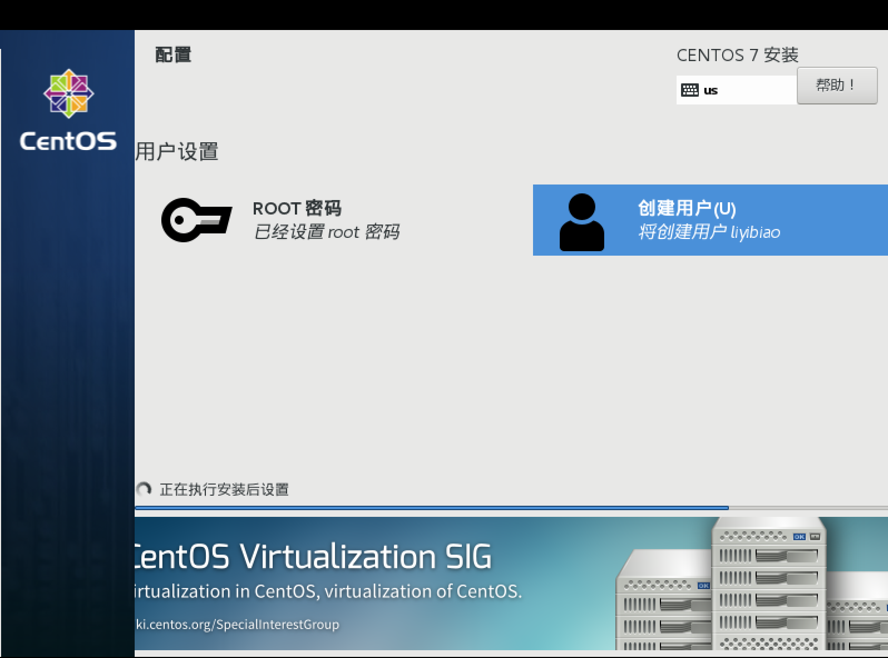

